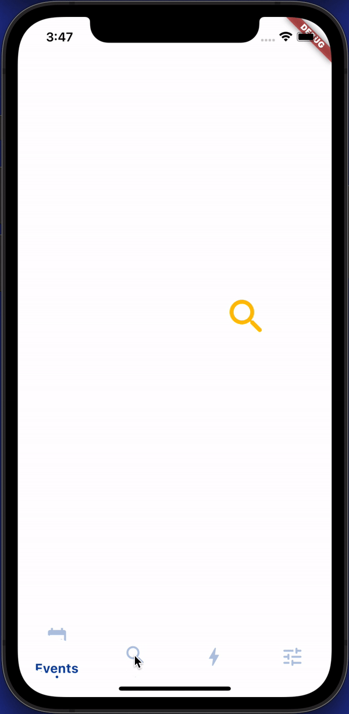

# sliding_clipped_nav_bar

Navigation bar inspired by Toolbar-icons-animation (designed by Cuberto).

## Demo Screen Recording

## **Design Credit**

[Toolbar icons animation by Cuberto](https://dribbble.com/shots/5605168-Toolbar-icons-animation)

### Disclaimer
The bar height is taller than normal and might not be suitable for small devices. Also don't make the icon size too big or they will be clipped. 

### **Suitable icon size**
 - FontAwesomeIcons: 24
 - MaterialIcons: 30

Feel free to report issue even if you are using a another icon pack and see some problem.

Check the example app the implementation is pretty straightforward.

Please consider giving me star and see my other repositories. This will motivate me to keep working.

### Follow me on social media
[Instagram](https://www.instagram.com/watery_desert)

[Twitter](https://www.twitter.com/watery_desert)